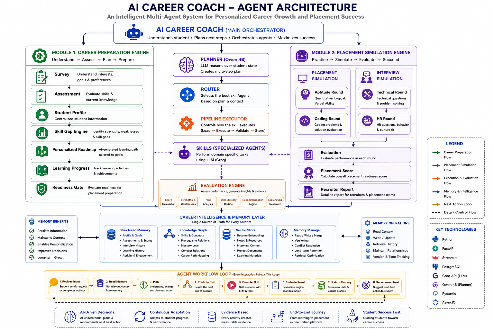

# AI Career Coach

### An Intelligent Multi-Agent System for Personalized Career Growth and Placement Success

AI Career Coach is an adaptive career guidance and placement preparation platform designed to understand a student's current state, identify skill gaps, personalize learning, simulate placement rounds, evaluate performance, and continuously recommend the next best action.

## 🎯 Problem Statement

Students often learn from multiple platforms but do not have a unified system that answers:

- What career role is suitable for me?
- What skills am I strong or weak in?
- What should I learn next?
- Am I ready for my target role?
- How will I perform in a real placement process?

Traditional systems commonly separate learning, assessment, and placement preparation.

**AI Career Coach connects these stages into one adaptive journey.**

## 💡 Solution

The system continuously transforms student activity into career intelligence:

1. Understand the student's profile, goals, interests, skills, projects, and history.
2. Assess current knowledge and performance.
3. Identify strengths and skill gaps.
4. Generate a personalized roadmap.
5. Track learning and progress.
6. Evaluate readiness.
7. Simulate placement activities.
8. Store evidence and update student memory.
9. Recommend the next best action.

> **Every student activity creates evidence, and every piece of evidence helps determine the next action.**

## 🏗️ System Architecture

<p align="center">
  
</p>

### Main Components

**AI Career Coach — Main Orchestrator**
- Understands student state
- Plans next steps
- Orchestrates Skills
- Maintains long-term understanding
- Adapts to student progress

**Planner — Qwen 4B**
- Understands student state
- Breaks down goals
- Creates short-term plans
- Prioritizes next actions

**Router**
- Selects the appropriate Skill
- Checks context and preconditions
- Routes execution

**Pipeline Executor**
- Loads context and instructions
- Executes the Skill
- Validates output
- Stores results

**Specialized Skills**
- Survey
- Assessment
- Learning
- Interview
- Reflection
- Company Fit
- Peer Benchmark
- Placement Simulation

**Evaluation Engine**
- Scores performance
- Tracks strengths and weaknesses
- Measures skill mastery
- Generates recommendations and explanations

**Career Intelligence & Memory**
- Student profile and goals
- Assessment and interview history
- Learning progress
- Skills and concepts
- Notes, resources, projects, and preferences
- Structured memory, knowledge graph, vector store, and memory management

## 🔄 Two Core Modules

### Module 1 — Career Preparation Engine

```text
Survey
   ↓
Assessment
   ↓
Student Profile
   ↓
Skill Gap Engine
   ↓
Personalized Roadmap
   ↓
Learning Progress
   ↓
Readiness Gate
```

### Module 2 — Placement Simulation Engine

```text
Placement Simulation
        │
        ├── Aptitude Round
        ├── Coding Round
        ├── Technical Round
        └── HR Round
                 ↓
             Evaluation
                 ↓
          Placement Score
                 ↓
          Recruiter Report
```

## 🔁 Agent Workflow

```text
Receive Input
     ↓
Read Memory
     ↓
Plan
     ↓
Route to Skill
     ↓
Execute Skill
     ↓
Evaluate Result
     ↓
Update Memory
     ↓
Recommend Next Action
     ↓
Repeat
```

This creates a continuous adaptive loop rather than a fixed learning sequence.

## 🤖 AI Model Responsibilities

### Qwen 4B — Planner

Used for planning and reasoning:
- Student-state analysis
- Next-action planning
- Prioritization
- Multi-step planning
- Skill-gap reasoning

### Groq API — Content Generation

Used for:
- Survey questions
- Assessment questions
- Learning activities
- Coding problems
- Technical questions
- Interview questions

> **LLMs generate and reason. The backend controls the workflow.**

## 🧠 Career Intelligence Feedback Loop

```text
Career Preparation
       ↓
Student Evidence
       ↓
Career Intelligence
       ↓
Placement Simulation
       ↓
Placement Evidence
       ↓
Career Intelligence
       ↓
Updated Skill Gaps
       ↓
Targeted Learning
```

Example:

```text
Assessment
   ↓
DSA weakness detected
   ↓
Personalized Learning
   ↓
Coding Simulation
   ↓
Poor coding performance
   ↓
Career Intelligence
   ↓
Targeted DSA practice
```

## 📊 Evaluation & Readiness

The system tracks:
- Technical performance
- Skill mastery
- Learning progress
- Confidence
- Assessment scores
- Interview performance
- Placement performance
- Strengths and weaknesses

These signals contribute to readiness and next-action recommendations.

## 💾 Memory Architecture

```text
Structured Memory
 ├── Profile & Goals
 ├── Assessments & Scores
 ├── Interview History
 ├── Learning History
 └── Activity & Engagement

Knowledge Graph
 ├── Skills
 ├── Concepts
 ├── Prerequisites
 └── Relationships

Vector Store
 ├── Resume Embeddings
 ├── Notes & Resources
 ├── Interview Context
 └── Learning Materials

Memory Manager
 ├── Read
 ├── Write
 ├── Merge
 ├── Version
 └── Retrieve
```

## 🛠️ Technology Stack

- Python
- FastAPI
- Streamlit
- PostgreSQL
- Groq API
- Qwen 4B
- Pydantic
- AsyncIO

## 🧪 CLI-First Development

The backend is designed to be independently testable:

```bash
python -m backend.cli health
python -m backend.cli diagnose
python -m backend.cli test
python -m backend.cli benchmark
python -m backend.cli survey
python -m backend.cli assessment
python -m backend.cli skill-gap
python -m backend.cli roadmap
python -m backend.cli learning
python -m backend.cli reflection
python -m backend.cli readiness
python -m backend.cli aptitude
python -m backend.cli coding
python -m backend.cli technical
python -m backend.cli interview
python -m backend.cli hr
python -m backend.cli placement
python -m backend.cli placement-report
python -m backend.cli run
```

CLI, FastAPI, and Streamlit should use the same application services rather than duplicate business logic.

## 🚀 Running the Backend

```bash
python -m uvicorn main:app --reload --port 8000
```

Open:

```text
http://localhost:8000/docs
```

## 🖥️ Running Streamlit

After the backend is stable:

```bash
streamlit run frontend/app.py
```

Streamlit should display the current Skill, collect input, call backend APIs, display evaluation, and show the next action. Workflow decisions remain in the backend.

## 🔐 Environment Variables

Create `.env` locally:

```env
GROQ_API_KEY=your_groq_api_key
SECRET_KEY=your_random_application_secret
DATABASE_URL=your_database_connection_string
```

Never commit real API keys or secrets to GitHub. Add `.env` to `.gitignore`.

## 📂 Suggested Project Structure

```text
AI-Career-Coach/
├── README.md
├── .gitignore
├── .env.example
├── assets/
│   └── architecture.png
├── backend/
│   ├── api/
│   ├── core/
│   ├── workflow/
│   ├── planner/
│   ├── router/
│   ├── pipelines/
│   ├── skills/
│   ├── llm/
│   ├── evaluation/
│   ├── memory/
│   ├── intelligence/
│   ├── database/
│   ├── schemas/
│   └── cli/
├── frontend/
│   └── app.py
└── tests/
```

Use the existing implementation where possible rather than duplicating modules.

## 🔍 Design Principles

- **Modular:** Each Skill is independently executable.
- **Reusable:** Common execution logic is handled by Pipelines.
- **LLM-Agnostic:** Model providers are separated from business logic.
- **Evidence-Based:** Decisions use stored performance and activity evidence.
- **Adaptive:** The next action changes according to student progress.
- **Persistent:** Student context is retained across interactions.
- **Observable:** Workflow, Skill, LLM, evaluation, memory, and performance events can be logged.
- **Student-Centric:** The objective is to maximize placement readiness.

## 🌟 Key Differentiator

Traditional platform:

```text
Course → Test → Score
```

AI Career Coach:

```text
Student State
     ↓
Understand
     ↓
Plan
     ↓
Execute
     ↓
Evaluate
     ↓
Learn From Evidence
     ↓
Update Student State
     ↓
Next Best Action
     ↓
Repeat
```

The platform therefore acts as an **adaptive career intelligence system**, not simply a question generator or chatbot.

## 🎯 Expected Impact

### Students
- Better career direction
- Clearer skill gaps
- Personalized learning
- Continuous feedback
- Realistic placement practice
- Better understanding of placement readiness

### Institutions
- Better visibility into student skill gaps
- Targeted placement preparation
- Readiness tracking
- Evidence-based intervention

### Placement Teams
- Structured student readiness information
- Role-oriented preparation
- Realistic placement simulations
- Detailed performance evidence

## 🔮 Future Scope

- Company-specific preparation
- Company-fit matching
- Peer benchmarking
- Advanced recruiter simulations
- Voice-based interviews
- Automated coding evaluation
- Deeper knowledge-graph reasoning
- Advanced placement analytics
- Mentor escalation for low-confidence or complex cases

## 👨‍💻 Project Vision

> **From "What should I learn?" to "What should I do next?" to "Am I ready for the job?"**

AI Career Coach connects **career discovery, assessment, learning, evaluation, memory, and placement simulation** into one adaptive journey.

### Goal

**Maximize Student Placement Readiness.**
